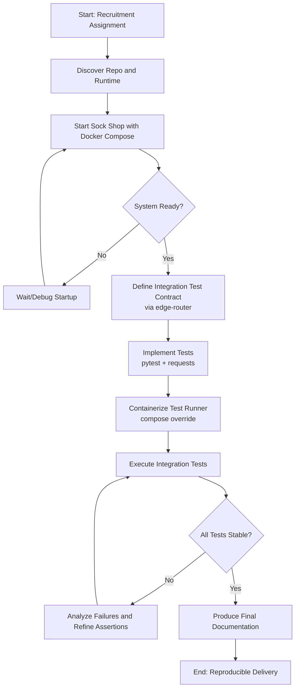

# Output 1: Understanding of the Problem

The problem is to complete a full, reproducible end-to-end execution of the Sock Shop recruitment assignment, not just write code in isolation.

That means delivering the whole lifecycle:

- run the microservices stack locally,
- design and implement two integration layers:
  - frontend-backend tests through the `edge-router`,
  - backend-only direct service integration tests,
- execute and debug until results are stable,
- and produce clear final documentation.

A key constraint is the working style: use AI-first ("Vibe Coding") for speed, while applying targeted human intervention for environment-specific setup, runtime validation, and quality/judgment decisions (for example, avoiding brittle or flaky tests).

# Output 2: Technical Approach

1. Repository and runtime discovery
   - Inspect `README`, compose files, and service topology.
   - Identify exact run commands, health endpoints, and where integration tests should live.

2. Bring up system under test
   - Start stack with Docker Compose.
   - Gate testing on readiness checks (container health, HTTP smoke checks, retry windows).

3. Define integration contracts by level
   - Frontend-backend suite: test via `edge-router` to mimic real consumer behavior.
   - Backend-only suite: test direct service reachability and core API contracts across catalogue/carts/orders/user/payment/shipping.
   - Cover: frontend availability, catalogue contract shape, tags endpoint, 404 negative path, lightweight latency budget, and non-5xx backend probes.

4. Implement test harness for repeatability
   - Build tests with `pytest` + `requests`.
   - Separate suites using markers:
     - `frontend_backend` and `backend`.
   - Add `run_integration_tests.py` with `TEST_SUITE` selector (`frontend-backend`, `backend-only`, `all`) for clear labeled output and visible test logs (`pytest -s -vv`).
   - Add service-aware runtime logging in tests (`[SERVICE]`, `[HTTP]`, `[TCP]`) for endpoint and infrastructure observability.
   - Add `run_integration_suites.sh` to execute both suites sequentially with per-suite and overall PASS/FAIL summary.
   - Persist run output to `output/integration-test-latest.md` (overwrite each run) for reviewer-ready evidence.
   - Containerize test execution via compose override so tests run consistently across machines.

5. Iterative execution and hardening
   - Run tests end to end, capture failures, classify root cause (service warmup vs assertion mismatch vs data/state).
   - Refine assertions to be meaningful but non-flaky; rerun to stable pass state.

6. Delivery documentation
   - Record objective, architecture-under-test, test matrix, execution commands, observed results, limitations, and next-step coverage.
   - Make the report reviewer-friendly and reproducible (clear commands + expected outcomes).

## Overall App Flow Diagram

## Current Documentation Artifacts

- `test.md`: operational guide for setup, execution modes, coverage, logging, and troubleshooting.
- `output/01-end-to-end-execution.md`: narrative of implementation workflow and delivery.
- `output/04-problem-understanding-and-approach.md`: problem framing and technical approach.
- `output/integration-test-latest.md`: latest run evidence (timestamp + results + full console output).
